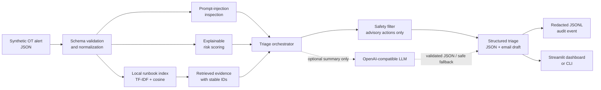

# OT Security Alert Triage Agent

A safe, explainable portfolio prototype that turns **synthetic, vendor-neutral OT monitoring alerts** into structured triage packages. It combines deterministic risk scoring, lightweight local retrieval over runbooks, guarded optional LLM summarization, escalation drafting, and an append-only audit trail.

> **Scope:** This is a local demonstration—not a production SOC platform, not connected to any OT environment, and not capable of executing remediation. All included organizations, assets, networks, findings, and events are fictional.

## What it demonstrates

- Python application design with separate models, retrieval, scoring, safety, audit, and orchestration layers
- Local retrieval-augmented generation (RAG) using transparent TF-IDF/cosine ranking with exact event-tag routing
- Explainable 0–100 risk scoring with asset criticality, event type, safety impact, exposure, and corroborating indicators
- Structured triage output: severity, confidence, rationale, runbook evidence, response plan, prohibited actions, escalation target, and email draft
- Prompt-injection detection for instruction-like content inside alerts and device metadata; flagged content disables the optional model path
- Human-in-the-loop boundaries: advisory output only, explicit change-control language, and no asset-control integration
- Optional OpenAI-compatible summary enrichment with deterministic fallback; no API key is required for the complete demo path
- JSONL audit events containing an input digest and decision metadata—not raw alert descriptions or credentials
- Unit tests for input validation, retrieval, scoring, safeguards, fallback behavior, and audit output

## Architecture



The LLM is deliberately outside the decision path. It may rewrite the executive summary, but it cannot change the deterministic severity, score, evidence, recommended actions, or prohibited actions. When instruction-like content is detected, the model call is skipped and the deterministic result is retained.

## Run it

### Interactive dashboard

```bash
python -m venv .venv
source .venv/bin/activate
python -m pip install -r requirements.txt
streamlit run app.py
```

Choose one of five synthetic scenarios and select **Analyze alert**. Deterministic demo mode works offline and needs no key.

The dashboard never accepts an endpoint or API key from a visitor. Optional model settings and credentials are read only from the server environment; the LLM choice appears only when the operator has configured an endpoint and model.

### Command line

The analysis engine and CLI use only the Python standard library:

```bash
PYTHONPATH=src python -m ot_triage_agent --alert-id OT-SYN-001
```

Other useful examples:

```bash
PYTHONPATH=src python -m ot_triage_agent --alert-id OT-SYN-005
PYTHONPATH=src python -m ot_triage_agent --alert-file ./my-synthetic-alert.json
```

The first command analyzes unexpected outbound traffic. The second demonstrates that instruction-like alert content is flagged and treated as evidence rather than obeyed.

## Optional OpenAI-compatible enrichment

Copy `.env.example` values into your shell or local secret manager. Do not commit `.env`.

```bash
export OT_AGENT_LLM_BASE_URL="https://api.openai.com/v1"
export OT_AGENT_LLM_MODEL="your-model-name"
export OT_AGENT_LLM_API_KEY="your-key"
export OT_AGENT_LLM_ALLOWED_HOSTS="api.openai.com"
PYTHONPATH=src python -m ot_triage_agent --alert-id OT-SYN-001 --llm
```

An OpenAI-compatible endpoint must implement `POST /chat/completions`, use HTTPS, and match an exact hostname in the operator-controlled `OT_AGENT_LLM_ALLOWED_HOSTS` allowlist. URLs containing embedded credentials, queries, or fragments are rejected. If configuration, connectivity, or response validation fails, the engine records the failure category and returns the full deterministic result. The key is used only in the outbound authorization header and is never delivered to the browser or passed to the audit logger.

Before sending real organizational data to any model provider, obtain approval, classify the data, minimize fields, and follow the organization's privacy, residency, retention, and vendor-risk requirements. The supplied data is synthetic so the project can be demonstrated safely.

## Decision pipeline

1. **Validate** required fields, data types, criticality range, list fields, and size limits.
2. **Inspect** the full normalized alert—including every string field, indicator, and serialized metadata—for common instruction-override, prompt-disclosure, tool-coercion, and exfiltration patterns.
3. **Score** the event using visible weights in `scoring.py`.
4. **Retrieve** the most relevant local runbooks and retain their IDs and similarity scores as evidence.
5. **Filter** recommended actions for dangerous, ungoverned instructions.
6. **Compose** an analyst-facing result and escalation email that require human validation and approved change control.
7. **Optionally enrich** only the executive summary with an allowlisted OpenAI-compatible model, and skip the call when instruction-like content is detected.
8. **Audit** the decision metadata using an input hash instead of storing the full alert body.

### Risk bands

| Score | Severity | Intended handling |
|---:|---|---|
| 0–34 | Low | Record and monitor |
| 35–64 | Medium | Analyst validation and owner coordination |
| 65–84 | High | Timely escalation and documented response planning |
| 85–100 | Critical | Immediate human escalation under site procedures |

The score is a demonstration aid, not a replacement for a site's safety case, incident-classification standard, threat intelligence, or engineering judgment.

## Sample alert contract

```json
{
  "alert_id": "OT-SYN-900",
  "title": "Synthetic network anomaly",
  "description": "Traffic differs from the approved baseline.",
  "asset_name": "LAB-HMI-01",
  "asset_type": "Human-Machine Interface",
  "asset_criticality": 4,
  "zone": "Isolated Training Zone",
  "event_type": "suspicious_connection",
  "detected_at": "2026-09-19T08:42:15Z",
  "source_ip": "10.99.0.10",
  "destination_ip": "192.0.2.10",
  "protocol": "TLS",
  "indicators": ["First-seen destination"],
  "known_exploited": false,
  "safety_impact": false,
  "internet_exposed": false,
  "metadata": {"synthetic": true}
}
```

Supported demonstration event types are `malware`, `suspicious_connection`, `vulnerability`, `asset_offline`, `degraded_network`, `unauthorized_change`, and `authentication_anomaly`. Unknown event types are accepted with a conservative generic base score.

## Tests and quality checks

```bash
PYTHONPATH=src python -m unittest discover -s tests -v
python -m pip install -e ".[dev]"
ruff check .
pytest
```

## Repository map

```text
.
├── app.py                         # Streamlit user interface
├── data/
│   ├── alerts.json                # Five synthetic scenarios
│   └── runbooks.json              # Local retrieval corpus
├── docs/
│   ├── DESIGN.md                  # Engineering choices and extension points
│   └── THREAT_MODEL.md            # Trust boundaries and mitigations
├── src/ot_triage_agent/
│   ├── audit.py                   # Redacted JSONL events
│   ├── cli.py                     # Command-line entry point
│   ├── llm.py                     # Optional summary enrichment
│   ├── models.py                  # Validated domain objects
│   ├── retrieval.py               # Local TF-IDF index
│   ├── safeguards.py              # Injection and unsafe-action controls
│   ├── scoring.py                 # Explainable risk model
│   └── triage.py                  # End-to-end orchestration
└── tests/                         # Unit test suite
```

## Honest portfolio positioning

Suggested resume wording after personally reviewing and understanding the code:

> Built a local Python/Streamlit OT alert triage prototype using explainable risk scoring and runbook-grounded retrieval, with structured escalation outputs, prompt-injection safeguards, optional LLM summarization, redacted audit logging, and automated tests over fully synthetic data.

Do not describe this project as production-deployed, integrated with a client, or autonomously remediating OT systems.

## Limitations

- The retrieval corpus is intentionally small and synthetic; it is not a substitute for site-specific runbooks.
- TF-IDF is transparent and offline but does not provide semantic retrieval equivalent to a validated embedding pipeline.
- Pattern matching reduces common prompt-injection risk but cannot prove that content is safe.
- The demo does not ingest live telemetry, enrich from commercial threat feeds, manage cases, authenticate users, or enforce role-based access.
- The risk weights are illustrative and require governance, calibration, and validation before any operational use.
- The optional LLM response is limited to summary text and the endpoint is HTTPS-allowlisted, but a production design would still need authentication, provider governance, DNS/network egress controls, red-team testing, telemetry, rate controls, and output evaluation.

## License

MIT
